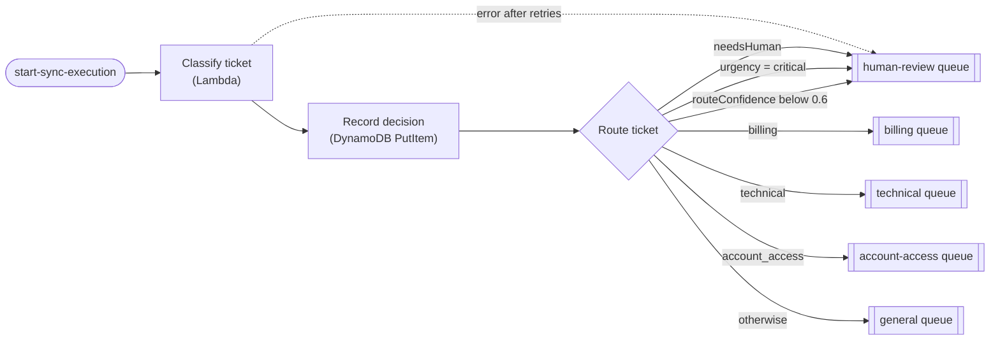

# Step Functions Ticket Router: OpenAI Decisions API vs Claude on Bedrock

Build a support-ticket router with AWS Step Functions twice: once with a
Lambda that calls the [OpenAI Decisions API](https://community.openai.com/t/decisions-api-is-now-available-in-public-beta/1403877)
(beta, `gpt-6-luna`), and once with a Lambda that calls Claude on Amazon
Bedrock using structured outputs. Both feed the same Choice state. Then
compare latency, cost and type safety in TypeScript.

## Architecture



Two Express state machines are deployed from the same `TicketRouter`
construct (`lib/constructs/ticket-router.ts`). Their definitions are
identical. A test asserts this. Only the classifier Lambda differs:

| State machine                                  | Classifier Lambda               | Model call                                                              |
| ---------------------------------------------- | ------------------------------- | ----------------------------------------------------------------------- |
| `step-functions-ticket-router-<env>-decisions` | `src/handlers/decisions-router` | `openai.decisions.create()`: one choice, score and predicate question   |
| `step-functions-ticket-router-<env>-claude`    | `src/handlers/claude-router`    | `AnthropicBedrockMantle.beta.messages.parse()` with a Zod output format |

Both Lambdas return the same `RouteDecision` (`src/shared/routing.ts`), so the
Choice state can't tell which provider produced it.

| Stack                                          | Contents                                                       |
| ---------------------------------------------- | -------------------------------------------------------------- |
| `step-functions-ticket-router-stateful-<env>`  | Decisions table, OpenAI API key secret, five SQS queues        |
| `step-functions-ticket-router-stateless-<env>` | Two classifier Lambdas, two Express state machines, log groups |

## The same question, asked two ways

Every ticket gets three questions: which queue, how urgent, and whether a
human must look first. With the Decisions API, each is a typed question:

```ts
const decision = await client.decisions.create({
  model: 'gpt-6-luna',
  input: 'Subject: Charged twice\n\nPlease refund the duplicate charge.',
  questions: [
    {
      type: 'choice',
      name: 'route',
      instructions: '...',
      choices: ROUTES.map((value) => ({ value })),
    },
    {
      type: 'score',
      name: 'urgency',
      instructions: '...',
      levels: URGENCY_LEVELS.map((label) => ({ label })),
    },
    { type: 'predicate', name: 'needs_human', instructions: '...' },
  ],
});
// decision.answers: [{ type: 'choice', choice: 'billing', confidence: 0.93, probabilities }, ...]
```

With Claude, the three answers are one Zod schema:

```ts
const RoutingSchema = z.object({
  route: z.enum(ROUTES),
  urgency: z.enum(URGENCY_LEVELS),
  needs_human: z.boolean(),
});

const message = await client.beta.messages.parse({
  model: 'anthropic.claude-opus-5-5',
  max_tokens: 2048,
  system: SYSTEM_PROMPT,
  messages: [{ role: 'user', content: buildContent(ticket) }],
  output_config: { effort: 'low', format: betaZodOutputFormat(RoutingSchema) },
});
// message.parsed_output: { route: 'billing', urgency: 'normal', needs_human: false } | null
```

## Type safety compared

|                            | OpenAI Decisions API                                                                                                                | Claude on Bedrock (structured outputs)                                                                                                             |
| -------------------------- | ----------------------------------------------------------------------------------------------------------------------------------- | -------------------------------------------------------------------------------------------------------------------------------------------------- |
| Response type              | `Decision.answers`: a union of predicate, choice, score and refusal answers                                                         | `parsed_output: z.infer<typeof RoutingSchema> \| null`                                                                                             |
| Getting your domain type   | Find each answer by `name`, narrow on `type`, check `choice` against your union (`isRoute`). `choice` is typed `string \| boolean`. | Direct. `parsed_output.route` is already `Route`.                                                                                                  |
| Allowed values enforced by | The server: a choice answer is always one of the supplied `choices`                                                                 | The client: the SDK moves `enum` into the field description, so the API constrains the JSON shape and Zod rejects out-of-range values in `parse()` |
| Confidence                 | Calibrated probabilities per choice, plus `confidence`                                                                              | None. `routeConfidence` is `null`, so the Choice state's confidence rule never fires                                                               |
| Ordinal output             | `score` is a probability-weighted index (e.g. `1.6`), so you snap it to a level                                                     | You get a level directly, with no notion of "between `normal` and `high`"                                                                          |
| Refusals                   | Per question: `{ type: 'refusal', name }`                                                                                           | Per request: `stop_reason: 'refusal'`. This demo registers `betaRefusalFallbackMiddleware` to retry on `anthropic.claude-opus-4-8` first           |
| Images                     | Inline base64 data URLs only (`input_image`)                                                                                        | Base64 `image` blocks                                                                                                                              |

In both routers, any refusal or unparseable answer sets `needsHuman: true`.
The safe failure is a person, never a silently defaulted queue.

## Latency and cost

Run the comparison yourself with the labelled tickets in `data/tickets.json`.
Don't take the "10x faster" claim, or this README, on trust:

```bash
export OPENAI_API_KEY=sk-...
export AWS_REGION=us-east-1      # with AWS credentials that can call bedrock-mantle
npm run compare -- --runs 3
```

It calls both classifiers directly (no Lambda), alternating which provider
goes first, and prints a table like this:

```text
| Provider         | Model                     | Route accuracy | Escalation accuracy | p50 latency | p95 latency | Cost / 1k tickets |
| ---------------- | ------------------------- | -------------- | ------------------- | ----------- | ----------- | ----------------- |
| openai-decisions | gpt-6-luna                | …              | …                   | … ms        | … ms        | $…                |
| claude-bedrock   | anthropic.claude-opus-5-5 | …              | …                   | … ms        | … ms        | $…                |
```

Raw samples are written to `results/` (git-ignored). Pass `--claude-model` or
`--openai-model` to try other models, for example
`--claude-model anthropic.claude-haiku-4-5` for a cheaper, faster Claude
baseline.

Cost estimates use `src/shared/pricing.ts`: the Decisions API bills only
input tokens ($0.10 per million). The Claude defaults are Anthropic list
prices. Bedrock sets its own rates, so set `CLAUDE_INPUT_USD_PER_MTOK` and
`CLAUDE_OUTPUT_USD_PER_MTOK` to your rate before quoting numbers.

## Prerequisites

- [Node.js](https://nodejs.org/) 20 or later and npm 10 or later
- An AWS account and credentials available to the AWS CLI / SDK
- The target account and region [bootstrapped for CDK v2](https://docs.aws.amazon.com/cdk/v2/guide/bootstrapping.html)
- Access to the Claude model in Amazon Bedrock in the target region. The
  Claude Lambda calls the Bedrock Mantle endpoint
  (`bedrock-mantle.<region>.api.aws/anthropic`), which authorises
  `bedrock-mantle:CreateInference`, not `bedrock:InvokeModel`.
- An OpenAI API key with access to the Decisions API beta

## Deploy

```bash
cd step-functions-ticket-router
npm ci

# One-time per account/region.
npx cdk bootstrap

npx cdk deploy --all
```

The OpenAI key is never put in a template. The secret is created with a
placeholder; set the real value after the first deploy:

```bash
aws secretsmanager put-secret-value \
  --secret-id "$(aws cloudformation describe-stacks \
      --stack-name step-functions-ticket-router-stateful-dev \
      --query "Stacks[0].Outputs[?OutputKey=='OpenAiSecretName'].OutputValue" --output text)" \
  --secret-string "sk-..."
```

Choose models through CDK context:

```bash
npx cdk deploy --all -c claudeModel=anthropic.claude-haiku-4-5 -c openaiModel=gpt-6-luna
npx cdk deploy --all -c env=prod
```

## Route a ticket

Express state machines support synchronous execution, so you get the
decision back in the response:

```bash
STATE_MACHINE_ARN=$(aws cloudformation describe-stacks \
  --stack-name step-functions-ticket-router-stateless-dev \
  --query "Stacks[0].Outputs[?OutputKey=='ClaudeStateMachineArn'].OutputValue" --output text)

aws stepfunctions start-sync-execution \
  --state-machine-arn "$STATE_MACHINE_ARN" \
  --input '{"ticket":{"ticketId":"T-42","subject":"API returning 500s","body":"Every POST to /v2/orders fails since 09:10 UTC."}}' \
  --query output --output text | jq
```

Use `DecisionsStateMachineArn` for the OpenAI version. Send the same
`ticketId` to both and the decisions table holds one item per provider:

```bash
aws dynamodb query --table-name <DecisionsTableName> \
  --key-condition-expression 'ticketId = :t' \
  --expression-attribute-values '{":t":{"S":"T-42"}}'
```

To attach a screenshot, add `"screenshot": "data:image/png;base64,..."` to the
ticket. Both providers accept inline base64 images only.

## Project structure

```text
bin/step-functions-ticket-router.ts   CDK app entry point
lib/stateful-stack.ts                  Decisions table, OpenAI secret, route queues
lib/stateless-stack.ts                 Classifier Lambdas and the two state machines
lib/constructs/ticket-router.ts        The shared Classify → Record → Choice workflow
lib/shared/config.ts                   Per-environment configuration (dev/prod)
src/shared/routing.ts                  Routes, urgency levels and the RouteDecision contract
src/shared/models.ts                   Default model IDs
src/shared/pricing.ts                  Token prices used for cost estimates
src/classifiers/openai-decisions.ts    Decisions API call and answer mapping
src/classifiers/claude-bedrock.ts      Bedrock structured-output call and mapping
src/handlers/                          Thin Lambda handlers around the classifiers
scripts/compare.ts                     Accuracy, latency and cost comparison
data/tickets.json                      Labelled tickets, including a prompt-injection attempt
test/                                  Jest tests: classifier mapping and CDK assertions
```

## Useful commands

| Command             | Description                                     |
| ------------------- | ----------------------------------------------- |
| `npm run build`     | Type-check and compile the TypeScript sources   |
| `npm run typecheck` | Type-check the project with `tsc --noEmit`      |
| `npm test`          | Type-check, then run the Jest test suite        |
| `npm run lint`      | Run ESLint                                      |
| `npm run compare`   | Compare both classifiers on `data/tickets.json` |
| `npm run synth`     | Synthesize the CloudFormation templates         |
| `npm run deploy`    | Deploy all stacks                               |
| `npm run destroy`   | Destroy all stacks                              |

Snapshot tests are updated with `npm test -- -u`.

## CI/CD

The repository-level workflows `.github/workflows/ci-step-functions-ticket-router.yml`
and `.github/workflows/deploy-step-functions-ticket-router.yml` run lint, test
and `cdk synth` on pull requests, and deploy on push to `main`.

## Cleanup

```bash
npx cdk destroy --all
```

In `prod` the table, queues and secret use a `RETAIN` removal policy and must
be deleted by hand.

## Security

See [CONTRIBUTING](CONTRIBUTING.md#security-issue-notifications) for more
information.

## License

This library is licensed under the MIT-0 License. See the [LICENSE](LICENSE)
file.
